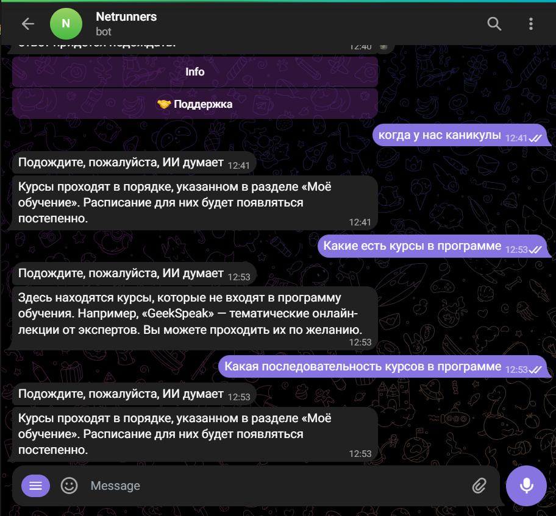

<h1>Цифровой прорыв</h1>
<h2>Второй пилот для куратора/специалиста поддержки</h2>

Задача: написать языковую модель, которая смогла бы обрабатывать организационные вопросы студентов GeekBrains и отвечать на них в свободной форме

2 Модели:

<ol>
  <li>tf-idf, catboost</li>
  <li>Transformer (RuBERT от DeepPavlov)</li>
</ol>

<h2>Результат</h2>

